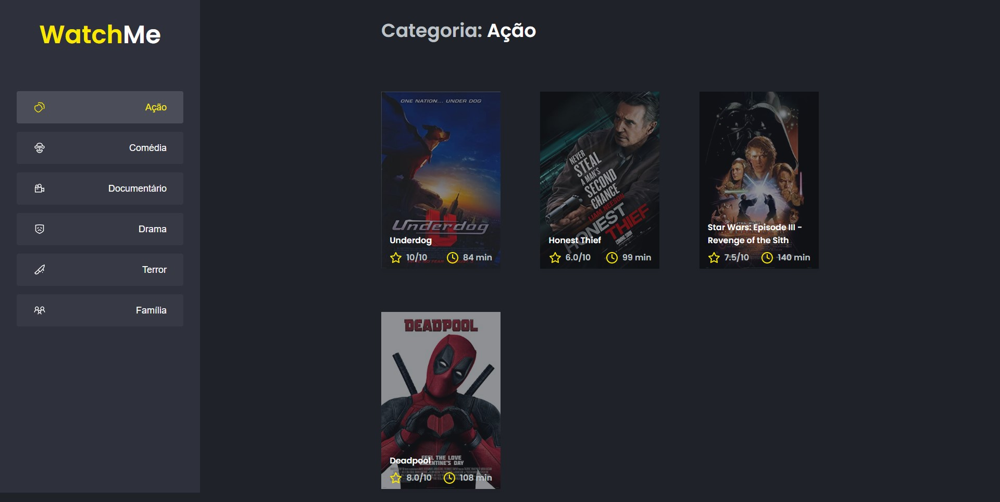

# Desafio Context API / Context API challenge

Proposta de desafio para refatorar um aplicativo e compartilhar o estado entre os componentes / 
Challenge proposal for re-factoring an application and share state between components

⚙️ **Tecnologias utilizadas / Used Technologies**
 
- [Axios](https://axios-http.com/)
- [Typescript](https://www.typescriptlang.org/)
- [ReactJS](https://reactjs.org/)
- [Sass](https://sass-lang.com/)

----------------------------------------------------------------------------------------------------------

🚀 **Como rodar o projeto / Running the project**

- Executando o servidor falso com o servidor JSON / Running the fake server with JSON Server
`yarn server`
 
- Executando o fornt-end / Running the front-end
`yarn dev`

----------------------------------------------------------------------------------------------------------

🧑🏾‍💻 **Autor / Author**

**Matheus Gomes de Souza**

LinkedIn: https://www.linkedin.com/in/matheus-gomes-de-souza/  
E-mail: matheusg_souza@outlook.com
